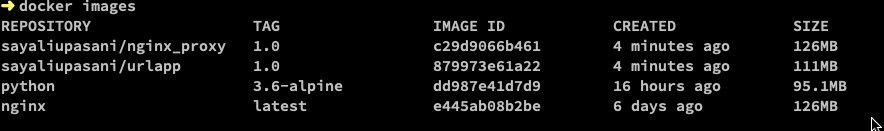
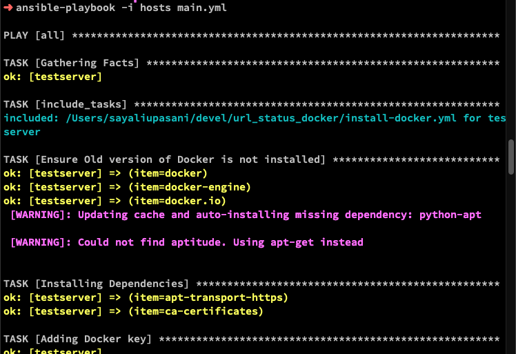
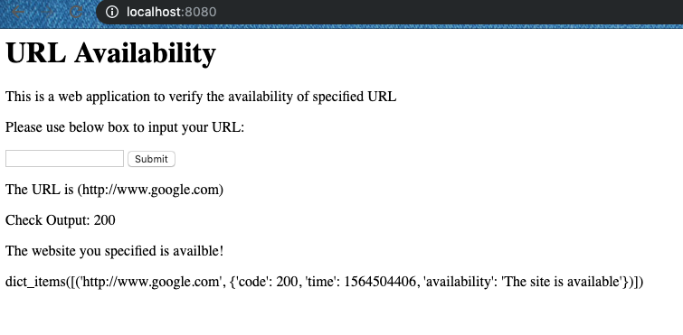

### Basic Idea of the repo

This repo includes python code for an application that verifies the status of the URL and holds the value in dictionary so that the requests are not repeated for specified hold time.
The app works with two containers - one is to serve the python application and an nginx server that listens on port 80 for requests and has capabilites to perform load balancing between multiple containers running the python application.

### Python modules used

>-Flask to serve the webpage
>- request to perform http request on user-specified URL and save the status code
>-render_template to serve the html page over Flask
>- time to hold the URL and corresponding status entries for coded time.

### Ansible files

1) main.yml: Ansible playbook to install docker, application dependencies, pull docker images from hub, run the containers
2)install-docker.yml: Used as a task module within main.yml for installing docker on vagrant host.

### How to run?

1) Using docker-compose.yml:

In the ansible playbook, I have pulled the docker images from docker hub.
If you wish to create the image and run containers manually, you can follow below steps:

- Use the docker-compose.yml file and execute below command in same directory:

  `docker-compose up`
  
  This will build the two images and run containers as:
  
  
  
  
 - You can access the application on your localhost:80.
 
 2) Using Dockerfile to build images and run containers via command line:
 
 - Use the Dockerfile in root of repo and execute below command to build our app image:
 
   `docker build -t sayaliupasani/app:testver .`
 
 - Use the Dockerfile within nginx directory and execute below command to build nginx image:

     `docker build -t sayaliupasani/nginx:testver .`
  
 - To verify that the images are build:

   `docker images -a`
 
 - To run the containers, execute below commands:
 
   Note: Before you run the containers, you need to create a docker network im which these two containers will reside.
   
   `docker network create url_net`
 
   app container: `docker run -d --name urlapp --hostname urlapp --network=url_net sayaliupasani/app:testver`
   
   nginx container: `docker run -d -p 80:80 -v ~/devel/url_status_docker/nginx/data:/etc/nginx/conf.d --network=url_net --name nginx_con sayaliupasani/nginx:testver`
   
- You can access the application over localhost:80 as nginx will serve the requests and redirect it to app container listening on port 5000 by default.
   
3) Using Ansible playbook

I have used vagrant to bring up a VM host and configured port forwarding as 8080:80.

To bring up the docker containers on this VM host, you can run the main.yml playbook as below:

`ansible-playbook -i hosts main.yml`

This will configure the VM host with necessary packages and run the containers.

If you log into your VM host, you can verify the two containers running.

To access the application from your host machine, you can access it over localhost:8080.

### Further plans

1) Currently the nginx is not load-balancing traffic to multiple app containers since the accessed URLs are not stored in database.
I plan to implement redis database that can be used to store the accessed URLs and relevant status codes from both the containers.
2) I plan to codify this app with Terraform using docker provider (I might create a separate repo for that).